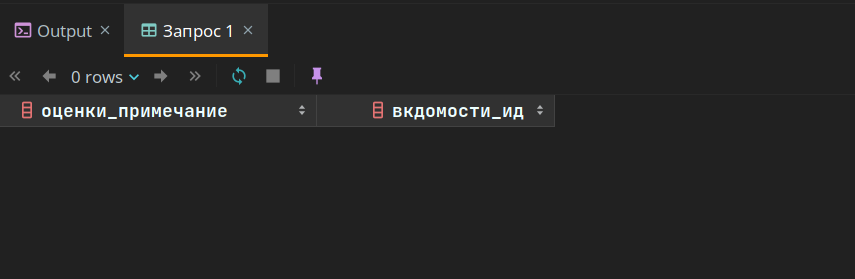
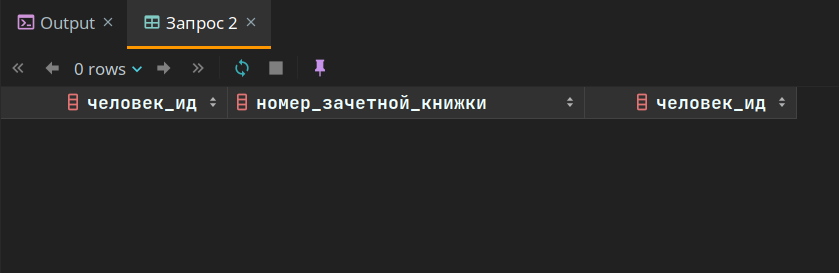
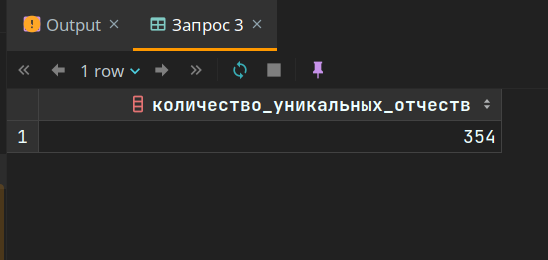
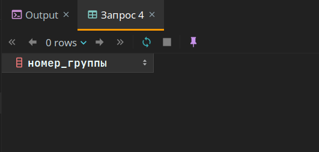
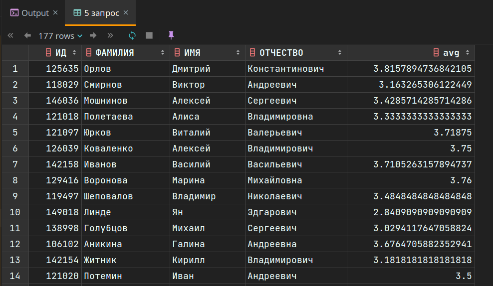
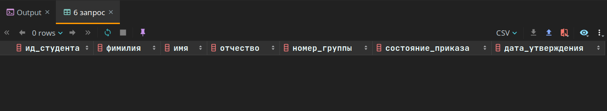
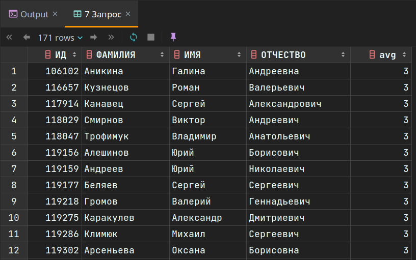

# Лабораторная работа #3

> Предмет: Базы данных

Реализация запросов на выборку разнородной информации к базе данных `ucheb` (информационная система университета: 
студенты, сессии, учебные планы и т.д.).

## Запрос 1

<br>

### Задание

Сделать запрос для получения атрибутов из указанных таблиц, применив фильтры по указанным условиям:

Таблицы: Н_ОЦЕНКИ, Н_ВЕДОМОСТИ.

Вывести атрибуты: Н_ОЦЕНКИ.ПРИМЕЧАНИЕ, Н_ВЕДОМОСТИ.ИД.

Фильтры (AND):
1. Н_ОЦЕНКИ.ПРИМЕЧАНИЕ = неудовлетворительно.
2. Н_ВЕДОМОСТИ.ДАТА > 2010-06-18.
3. Н_ВЕДОМОСТИ.ДАТА < 1998-01-05.

Вид соединения: INNER JOIN.

### Запрос

```postgresql
select
    оценки."ПРИМЕЧАНИЕ" as оценки_примечание,
    ведомости."ИД" as вкдомости_ид
from
    "Н_ВЕДОМОСТИ" as ведомости
    join
    "Н_ОЦЕНКИ" as оценки
    on ведомости."ОЦЕНКА" = оценки."КОД"
where
    оценки."ПРИМЕЧАНИЕ" = 'неудовлетворительно'
    and
    ведомости."ДАТА" > '2010-06-18'::timestamp
    and
    ведомости."ДАТА" < '1998-01-05'::timestamp;
```

### Результат выполнения запроса


### Комментарий к результату запроса
Дата в задании указана таким образом, что требуется найти дни, дата которых одновременно больше большей даты по 
заданию и меньше меньшей, 
что в результате дает пустое множество.

<br>

## Запрос 2

### Задание

Сделать запрос для получения атрибутов из указанных таблиц, применив фильтры по указанным условиям:

Таблицы: Н_ЛЮДИ, Н_ОБУЧЕНИЯ, Н_УЧЕНИКИ.

Вывести атрибуты: Н_ЛЮДИ.ИД, Н_ОБУЧЕНИЯ.НЗК, Н_УЧЕНИКИ.ИД.

Фильтры: (AND)
1. Н_ЛЮДИ.ИМЯ = Николай.
2. Н_ОБУЧЕНИЯ.ЧЛВК_ИД < 105590.

Вид соединения: RIGHT JOIN.

### Запрос
```postgresql
select
    люди."ИД" as человек_ид,
    обучения."НЗК" as номер_зачетной_книжки,
    ученики."ИД" as человек_ид
from
     "Н_ЛЮДИ" as люди
     right join
     "Н_ОБУЧЕНИЯ" as обучения
     on люди."ИД" = обучения."ЧЛВК_ИД"
     right join
     "Н_УЧЕНИКИ" as ученики
     on люди."ИД" = ученики."ЧЛВК_ИД"
where
    люди."ИМЯ" = 'Николай'
    and
    обучения."ЧЛВК_ИД" < 105590;
```

### Результат выполнения запроса


### Комментарий к результату запроса
Видимо, Николаев с таким айдишником нет.

<br>

## Запрос 3

### Задание
Вывести число отчеств без учета повторений.

При составлении запроса нельзя использовать DISTINCT.

### Запрос
```postgresql
with уникальные_отчества as (
    select "ОТЧЕСТВО", count(*) as количество_отчеств
    from "Н_ЛЮДИ"
    group by "ОТЧЕСТВО"
)
select count(*) from уникальные_отчества;
```

### Результат выполнения запроса


### Комментарий к результату запроса
Вместо исопльзования `DISTINCT` можно сделать следующее:
1. Провести группировку по одинаковым отчествам
2. Посчитать количество строк в полученной таблице

<br>

## Запрос 4

### Задание

Найти группы, в которых в 2011 году было ровно 5 обучающихся студентов на ФКТИУ.

Для реализации использовать подзапрос.

### Запрос

```postgresql
with группа_ученики as
(
    select группы_2011_КТиУ.номер, count(*) as количество_учеников -- Считаем количество учеников в каждой группе
    from
    "Н_УЧЕНИКИ" as ученики
    join
    (
        select "ГРУППА" as номер -- Выбираем грцппы на нужных факультетах
        from
        "Н_ГРУППЫ_ПЛАНОВ" as группы_планы
        join
        (
            select планы_2011_года."ИД" -- Выбиарем планы 2011 года на нужном факультете
            from "Н_ОТДЕЛЫ" as отделы
            join
            (
                select "ИД", "ОТД_ИД" -- Выбираем планы 2011 года
                from "Н_ПЛАНЫ"
                where "Н_ПЛАНЫ"."УЧЕБНЫЙ_ГОД" = '2011/2012'
            ) as планы_2011_года
            on планы_2011_года."ОТД_ИД" = отделы."ИД"
            where отделы."КОРОТКОЕ_ИМЯ" = 'КТиУ'
        ) as планы_2011_КТиУ
        on группы_планы."ПЛАН_ИД" = планы_2011_КТиУ."ИД"
    ) as группы_2011_КТиУ
    on ученики."ГРУППА" = группы_2011_КТиУ.номер
    group by группы_2011_КТиУ.номер
)
select группа_ученики.номер as номер_группы-- Выбираем группы с 5 учениками
from группа_ученики
where группа_ученики.количество_учеников = 5;
```

### Результат выполнения запроса


### Комментарий к результату запроса

Результат пустой, так как не было найдено групп с 5 учениками на интересуемом факультете.

<br>

## Запрос 5

### Задание

Выведите таблицу со средними оценками студентов группы 4100 (Номер, ФИО, Ср_оценка), у которых средняя оценка не больше средней оценк(е|и) в группе 1100.

### Запрос
```postgresql

with человек_оценка as
(
    select ученики."ИД", ученики."ФАМИЛИЯ", ученики."ИМЯ", ученики."ОТЧЕСТВО", ведомости."ОЦЕНКА"
    from
    "Н_ВЕДОМОСТИ" as ведомости
    join
    (
        select "ИД", "ФАМИЛИЯ", "ИМЯ", "ОТЧЕСТВО"
        from
        "Н_ЛЮДИ" as люди
        join
        (
            select ученики."ЧЛВК_ИД"
            from "Н_УЧЕНИКИ" as ученики
            where ученики."ГРУППА" = '4100'
        ) as ученики_4100_группы
        on ученики_4100_группы."ЧЛВК_ИД" = люди."ИД"
    ) as ученики
    on ведомости."ЧЛВК_ИД" = ученики."ИД"
)
select "ИД", "ФАМИЛИЯ", "ИМЯ", "ОТЧЕСТВО", avg("ОЦЕНКА"::int)
from человек_оценка
where
    человек_оценка."ОЦЕНКА" ~ '^[0-9\.]+$'
    and человек_оценка."ОЦЕНКА"::numeric <=
        (
            with оценки as
            (
                select ведомости."ОЦЕНКА"
                from
                "Н_ВЕДОМОСТИ" as ведомости
                join
                (
                    select "ИД", "ФАМИЛИЯ", "ИМЯ", "ОТЧЕСТВО"
                    from
                    "Н_ЛЮДИ" as люди
                    join
                    (
                        select ученики."ЧЛВК_ИД"
                        from "Н_УЧЕНИКИ" as ученики
                        where ученики."ГРУППА" = '1100'
                    ) as ученики_4100_группы
                    on ученики_4100_группы."ЧЛВК_ИД" = люди."ИД"
                ) as ученики
                on ведомости."ЧЛВК_ИД" = ученики."ИД"
            )
            select avg("ОЦЕНКА"::int)
            from оценки
            where
                оценки."ОЦЕНКА" ~ '^[0-9\.]+$'
        )

group by "ИД", "ФАМИЛИЯ", "ИМЯ", "ОТЧЕСТВО";
```

### Результат выполнения запроса


### Комментарий к результату запроса

Как видно, в запросе дублицируется код, отвечающий за получение средних оценок студентов в конкретной группе. Его 
следовало бы вынести в функцию. Однако, в учебной базе данных запрещено создавать фенкции (нет прав на это).

<br>

## Запрос 6

### Задание

Получить список студентов, зачисленных до первого сентября 2012 года на первый курс очной формы обучения (специальность: 230101). В результат включить:

- номер группы;
- номер, фамилию, имя и отчество студента;
- номер и состояние пункта приказа;

- Для реализации использовать соединение таблиц.

### Запрос
```postgresql
select
    ученики."ИД" as ид_студента,
    люди."ФАМИЛИЯ" as фимилия,
    люди."ИМЯ" as имя,
    люди."ОТЧЕСТВО" as отчество,
    ученики."ГРУППА" as номер_группы,
    ученики."СОСТОЯНИЕ" as состояние_приказа,
    планы."ДАТА_УТВЕРЖДЕНИЯ" as дата_утверждения
from
"Н_УЧЕНИКИ" as ученики
join "Н_ПЛАНЫ" as планы
on ученики."ПЛАН_ИД" = планы."ИД"
join "Н_ФОРМЫ_ОБУЧЕНИЯ" as формы_обучения
on планы."ФО_ИД" = формы_обучения."ИД"
join "Н_НАПР_СПЕЦ" as специальности
on планы."НАПС_ИД" = специальности."ИД"
join "Н_ЛЮДИ" as люди
on ученики."ЧЛВК_ИД" = люди."ИД"
where
    ученики."НАЧАЛО" < '2012-9-1'::timestamp
    and
    планы."КУРС" = 1
    and
    формы_обучения."НАИМЕНОВАНИЕ" = 'Очная'
    and
    специальности."КОД_НАПРСПЕЦ" = '230101';
```

### Результат выполнения запроса


### Комментарий к результату запроса

На данной специальности никого не оказалост на первом курсе. Если убрать фильр по специальности, то станет видно, 
что специальности есть, однако с другими номерами.

<br>

## Запрос 7

### Задание

Сформировать запрос для получения числа в группе No 3100 троечников.

### Запрос

```postgresql
with человек_оценка as
    (
         select ученики."ИД", ученики."ФАМИЛИЯ", ученики."ИМЯ", ученики."ОТЧЕСТВО", ведомости."ОЦЕНКА"
         from
         "Н_ВЕДОМОСТИ" as ведомости
         join
         (
             select "ИД", "ФАМИЛИЯ", "ИМЯ", "ОТЧЕСТВО"
             from
             "Н_ЛЮДИ" as люди
             join
             (
                 select ученики."ЧЛВК_ИД"
                 from "Н_УЧЕНИКИ" as ученики
                 where ученики."ГРУППА" = '4100'
             ) as ученики_4100_группы
             on ученики_4100_группы."ЧЛВК_ИД" = люди."ИД"
         ) as ученики
         on ведомости."ЧЛВК_ИД" = ученики."ИД"
    )
select "ИД", "ФАМИЛИЯ", "ИМЯ", "ОТЧЕСТВО", avg("ОЦЕНКА"::int)
from человек_оценка
where
        человек_оценка."ОЦЕНКА" ~ '^[0-9\.]+$'
        and
        человек_оценка."ОЦЕНКА"::numeric >= 2.5
        and
        человек_оценка."ОЦЕНКА"::numeric < 3.5
group by "ИД", "ФАМИЛИЯ", "ИМЯ", "ОТЧЕСТВО";
```

### Результат выполнения запроса


### Комментарий к результату запроса

В выводе команды видно, что средняя оценка у учеников - тройка ( 2.5 <= оценка < 3.5).

---
---

# Вывод

Сложные запросы в данной лабораторной работе познакомили меня с 4 вещами:
1. Функционал ключевого слова `DISTINCT` может быть реализован через `count()`.
2. Ключевое слово `WITH <name> as ( <expression> )` - очень удобный инструмен для сохранения промежуточного 
   результата и работы с ним в дальнейшем. К тому же, в некторых ситуациях без него не обойтись.
3. Для реализации сложного запроса есть два варианта:
   - вложенные запросы (может возникнуть сильная вложеннось)
   - использование `join`'ов (вложенность будет значительно меньше)
